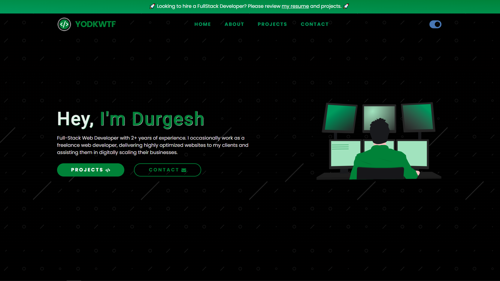

# My Portfolio - Official Website

A developer portfolio website built using ReactJS and Context API & React Hooks. It utilizes Airtable CMS to store and fetch data, allowing for easy customization of website content.

The website's design was created using Figma and features SVG illustrations from Undraw and SVG icons from Icons8. Form handling is done using Formspree, and the website is styled using CSS, including animations and transitions.

The website also has a Dark Mode which used localStorage API to save user's preferred theme.

Overall, this is a powerful and versatile ReactJS portfolio website that makes it easy to showcase a developer's skills and projects. It offers easy customization and deployment options, making it an ideal choice for developers looking to create a professional online presence.

## Preview

See it live at [yodkwtf.com](https://yodkwtf.com)



## Installation

To install and run the website locally, follow these steps:

1. Clone this repository to your local machine:

   ```sh
   git clone https://github.com/yodkwtf/yodkwtf.com.git
   ```

2. Install the required packages using npm or yarn:

   ```sh
   npm install
   ```

   or

   ```sh
   yarn install
   ```

3. Create a `.env` file in the root directory of the project and add your Airtable API key and base ID in the following format:

   ```makefile
   REACT_APP_API_KEY=<your_api_key>
   REACT_APP_BASE_ID=<your_base_id>
   ```

4. Start the development server:

   ```sh
   npm start
   ```

   or

   ```sh
   yarn start
   ```

5. Visit `http://localhost:3000` in your web browser to view the website.

## Usage

To customize the website content, you can update the data in your Airtable base. The website will automatically fetch and display the data based on the schema defined in `src/components/Projects.js` and `src/pages/ProjectsPage.js`.

To deploy the website, you can use a static site hosting service such as [Netlify](https://www.netlify.com/) or [Vercel](https://vercel.com/).

## Contributing

Contributions to this project are welcome! If you would like to contribute, please follow these guidelines:

1. Fork the repository and create a new branch for your changes.

1. Make your changes and test them thoroughly.

1. Ensure that your changes adhere to the style and functionality of the website.

1. Run the test suite to ensure that your changes do not break existing functionality:

   ```sh
   npm test
   ```

   or

   ```sh
   yarn test
   ```

1. Submit a pull request with your changes.

1. Your pull request will be reviewed by the maintainers. If there are any issues, they will provide feedback on how to address them.

1. Once your pull request is approved, it will be merged into the main branch.

By contributing to this project, you agree to license your contributions under the [MIT License](./LICENSE).

## Tech Stack

- ReactJS and Hooks
- Context API
- CSS Animations CSS Transitions
- localStorage API
- Airtable CMS

#### Resources

- [Figma - Website Design](https://www.figma.com/)
- [Airtable - Headless CMS](https://airtable.com/)
- [Undraw - SVG Illustrations](https://undraw.co/illustrations)
- [Formspree - Form Handling](https://formspree.io/)
- [Icons8 - SVG Icons](https://icons8.com/)

#### Packages

- [React Router Dom](https://www.npmjs.com/package/react-router-dom)
- [React Icons](https://www.npmjs.com/package/react-icons)
- [Normalize.css](https://necolas.github.io/normalize.css/)
- [React Helmet](https://www.npmjs.com/package/react-helmet-async)
- [Airtable Node](https://www.npmjs.com/package/airtable-node)
