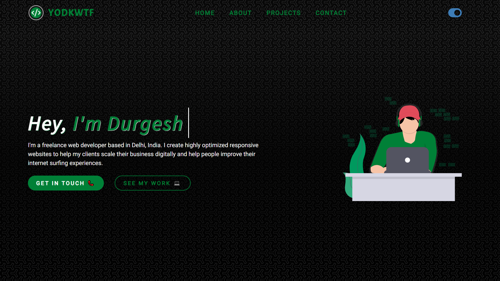

# Yodkwtf | My Portfolio Website

My personal portfolio website built with reactjs using modern react hooks for the functionality and react router dom to configure different pages within the site. The website also has a dark mode.
The design is a complete orginal created from scratch in Figma. I'm using airtable as a headless CMS for my projects.

## Preview

[www.yodkwtf.com - Live Site](https://yodkwtf.com)



## Stack

#### Resources

- [Figma - Website Design](https://www.figma.com/)
- [Airtable - Headless CMS](https://airtable.com/)
- [Undraw - SVG Illustrations](https://undraw.co/illustrations)
- [Formspree - Form Handling](https://formspree.io/)
- [Icons& - SVG Icons](https://icons8.com/)

#### Packages

- [React Router Dom](https://www.npmjs.com/package/react-router-dom)
- [React Icons](https://www.npmjs.com/package/react-icons)
- [React Helmet](https://www.npmjs.com/package/react-helmet-async)
- [Airtable Node](https://www.npmjs.com/package/airtable-node)

## How to Run?

To clone this project locally, run

```bash
  git clone https://github.com/yodkwtf/yodkwtf.com.git
```

To run this project locally, run

```bash
  npm install && npm start
```
