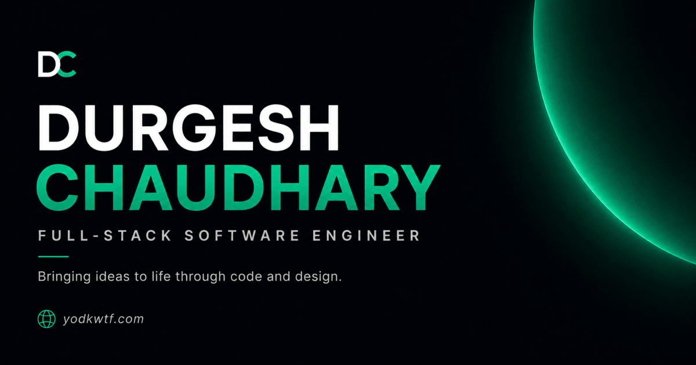

# My Portfolio Website

[](https://yodkwtf.com)
[](https://nextjs.org)
[](./LICENSE)

A personal portfolio built with **Next.js 16 (App Router, React Server Components, ISR)**, **React 19**, **TypeScript**, and **Tailwind CSS v4**. Powered by a headless **Sanity CMS** with static fallback data, it features an MDX-powered blog with syntax-highlighted code blocks, search, and scheduled publishing. Project pages render each repository's live **GitHub README**, while a **Resend-powered newsletter** automatically emails subscribers via **GitHub Actions** whenever new posts go live. The site also includes RSS, sitemap, JSON-LD, and Open Graph support, and is deployed on Netlify.

This repo is public for reference and learning. Feel free to explore the code,
open issues, or borrow patterns for your own site.

## Live Preview

See it live at [yodkwtf.com](https://yodkwtf.com) and please feel free to share any feedbacks.



## Tech stack

| Area       | Choice                                                         |
| ---------- | -------------------------------------------------------------- |
| Framework  | Next.js 16 (App Router, React Server Components)               |
| Language   | TypeScript, React 19                                           |
| Styling    | Tailwind CSS v4 with a CSS-variable design system              |
| Animation  | Framer Motion                                                  |
| CMS        | Sanity (embedded Studio at `/admin`)                           |
| Blog       | MDX via `next-mdx-remote`, `gray-matter`, `rehype-pretty-code` |
| Newsletter | Resend (Audience API + Broadcasts)                             |
| Hosting    | Netlify (`@netlify/plugin-nextjs`)                             |

## Features

- **Structured content** managed in Sanity (projects, skills, experience,
  about), fetched through typed GROQ queries with static fallback data for
  every section, so the site degrades gracefully if the CMS is unreachable.
- **Project case studies pulled live from GitHub.** Each project detail page
  renders the repo's own README (headings, images, code blocks, relative
  links all resolved) instead of a hand-written description, so docs stay in
  sync with the actual codebase.
- **MDX blog** with syntax-highlighted code blocks (filename tabs, per-language
  icons, copy button), callouts, YouTube embeds, image grids, and an
  auto-generated, scroll-spy table of contents.
- **Newsletter**, powered by Resend: a subscribe form that adds contacts to a
  Resend Audience, plus a scripted broadcast pipeline that emails subscribers
  automatically when a new post is published (including future-dated posts,
  via a daily GitHub Actions cron).
- **Light and dark themes** via a lightweight custom theme provider that
  avoids a flash of unstyled content on load.
- **Incremental Static Regeneration** so CMS edits and future-dated posts go
  live on their own, without a redeploy.
- Self-hosted fonts via `next/font` and optimized images with graceful
  fallbacks for fast, shift-free loads.
- SEO out of the box: sitemap, `robots.txt`, RSS feed, JSON-LD, and Open
  Graph / Twitter cards.

## Getting started

### Prerequisites

- Node.js 20.9 or newer
- A [Sanity](https://www.sanity.io) project (optional; the site renders
  static fallback content without one)
- A [Resend](https://resend.com) account (optional, only needed for the
  newsletter subscribe form and broadcast script; the free tier covers this
  project's volume)

### Installation

```bash
git clone https://github.com/yodkwtf/my-portfolio-website.git
cd my-portfolio-website
npm install
```

### Environment

Copy the example file and fill in your values:

```bash
cp .env.example .env.local
```

| Variable                         | Required | Description                                                                                      |
| -------------------------------- | -------- | ------------------------------------------------------------------------------------------------ |
| `NEXT_PUBLIC_SANITY_PROJECT_ID`  | No       | Sanity project ID. Omit to run entirely on fallback content.                                     |
| `NEXT_PUBLIC_SANITY_DATASET`     | No       | Sanity dataset name (defaults to `production`).                                                  |
| `NEXT_PUBLIC_SANITY_API_VERSION` | No       | Sanity API version (date-based, e.g. `2024-01-01`).                                              |
| `SANITY_API_TOKEN`               | No       | Only needed for write operations (e.g. scripted content migrations).                             |
| `NEXT_PUBLIC_SITE_URL`           | No       | Canonical site URL, used for metadata, sitemap, RSS, and JSON-LD.                                |
| `RESEND_API_KEY`                 | No       | Enables the newsletter subscribe API route and the broadcast script.                             |
| `RESEND_AUDIENCE_ID`             | No       | Resend Audience that subscribers are added to.                                                   |
| `NEWSLETTER_FROM`                | No       | Sender name/address for broadcast emails. Defaults to `Durgesh Chaudhary <durgesh@yodkwtf.com>`. |

None of these are required to run the site locally; every integration has a
fallback or is simply disabled when its env vars are absent.

For project detail pages to render live GitHub READMEs, no token is required
for public repos; requests are made anonymously to the GitHub API and are
cached for an hour.

### Development

```bash
npm run dev
```

Open [http://localhost:3000](http://localhost:3000). The Sanity Studio lives at
[http://localhost:3000/admin](http://localhost:3000/admin).

## Scripts

| Command                    | Description                                                                                    |
| -------------------------- | ---------------------------------------------------------------------------------------------- |
| `npm run dev`              | Start the development server                                                                   |
| `npm run build`            | Production build                                                                               |
| `npm run start`            | Serve the production build                                                                     |
| `npm run lint`             | Run ESLint                                                                                     |
| `npm run icons`            | Regenerate code-block file-type icons from `@iconify-json/vscode-icons`                        |
| `npm run newsletter`       | Send newsletter broadcasts for published posts not yet sent (`--dry-run`, `--seed`, `--force`) |
| `npm run newsletter:icons` | Regenerate the PNG social icons used in newsletter emails                                      |

## Project structure

```text
src/
  app/            Routes, layouts, API handlers, and the embedded Sanity Studio
  components/     UI, layout, section, and MDX components
  sanity/         Schemas, GROQ queries, and the configured client
  data/           Static fallback content used when the CMS is unavailable
  lib/            Blog loading, GitHub README fetching/rendering, utilities, logging
  config/         Single source of truth for site metadata
content/
  blogs/          MDX blog posts
scripts/
  send-newsletter.ts             Newsletter broadcast pipeline (run via GitHub Actions)
  generate-file-icons.mjs        Generates code-block file-type icon strings
  generate-newsletter-icons.mjs  Generates PNG social icons for newsletter emails
.github/workflows/
  newsletter.yml  Sends broadcasts on push to main, daily cron, and manual dispatch
```

## Content

- **CMS content** (projects, skills, experience, and the about page) is
  edited in the Sanity Studio at `/admin` and fetched server-side through
  typed GROQ queries. Social links come from `src/config/site.ts`, not Sanity.
- **Project case studies** are not authored in Sanity beyond card-level fields
  (title, summary, tech stack, links). Each detail page fetches and renders
  the linked GitHub repo's README as the full page content.
- **Blog posts** are MDX files in `content/blogs/`. Each file uses frontmatter
  for its title, description, publish date, category, tags, and optional
  cover image; see [Adding a blog post](#adding-a-blog-post) below. Drafts
  and posts dated in the future are hidden from all listings until their
  publish date passes.

### Adding a blog post

Create `content/blogs/<name>.mdx`. The filename is only for your own
ordering; the URL slug is derived from `title`, so a file named
`06-my-post.mdx` titled `"My Post"` serves at `/blog/my-post`.

```mdx
---
title: ''
description: ''
publishedAt: 'YYYY-MM-DD'
category: '' # shown as a pill in the blog list sidebar
tags: []
featured: false
draft: false
# optional: coverImage, youtubeId, updatedAt, author
---
```

Set `draft: true` to exclude a post from all listings. A future
`publishedAt` hides it until that date, then it publishes on its own thanks
to hourly ISR, no redeploy needed. Reading time is computed automatically.

Custom MDX components available in every post (see
`src/components/mdx/MDXComponents.tsx`): `<Callout>`, `<YouTube>`,
`<BlogImage>`, `<ImageGrid>`, `<Details>`. Fenced code blocks support a
`filename:` directive on their first line (in the appropriate comment syntax
for the language) to show a filename tab in the code toolbar.

### Newsletter

Publishing a post to `main` triggers `.github/workflows/newsletter.yml`,
which runs `npm run newsletter` to email any published posts not yet listed
in `scripts/newsletter-sent.json`. A daily cron re-runs the same check so
future-dated posts get emailed once they go live, without a manual trigger.
Run `npm run newsletter -- --dry-run` locally to preview without sending.

## Deployment

The site deploys to [Netlify](https://netlify.com) using the official
Next.js runtime (`@netlify/plugin-nextjs`). The build command is
`npm run build`; environment variables are configured in the Netlify
dashboard. `RESEND_API_KEY` and `RESEND_AUDIENCE_ID` also need to be set as
GitHub Actions secrets for the newsletter workflow to run.

## Contributing

This is a personal site, so feature requests are unlikely to be taken as-is,
but bug reports and PRs for genuine issues (broken links, accessibility
fixes, build errors) are welcome. Please open an issue first for anything
non-trivial.

## License

The source code in this repository is available under the terms in
[LICENSE](./LICENSE): free to read and learn from, not licensed for reuse or
redistribution. The brand, written content, and imagery are not licensed for
reuse under any circumstance.
